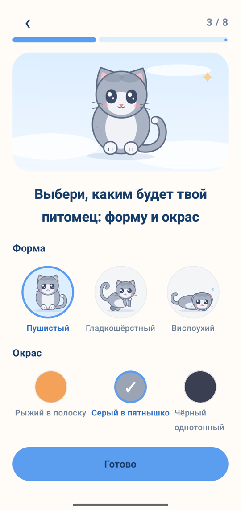
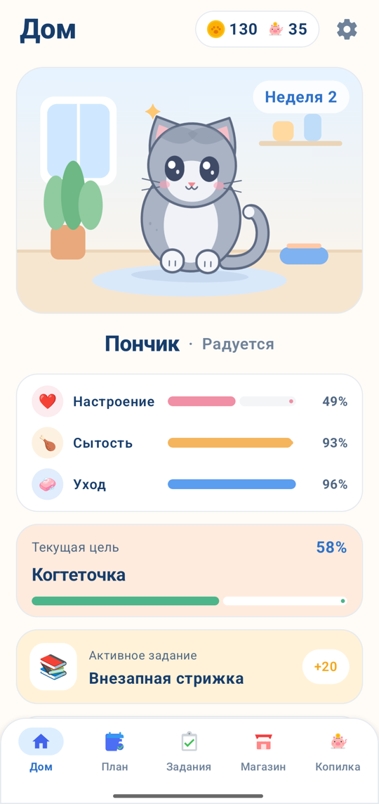
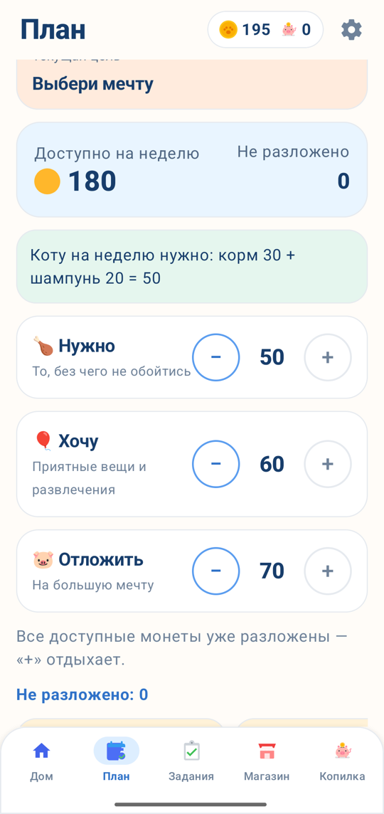
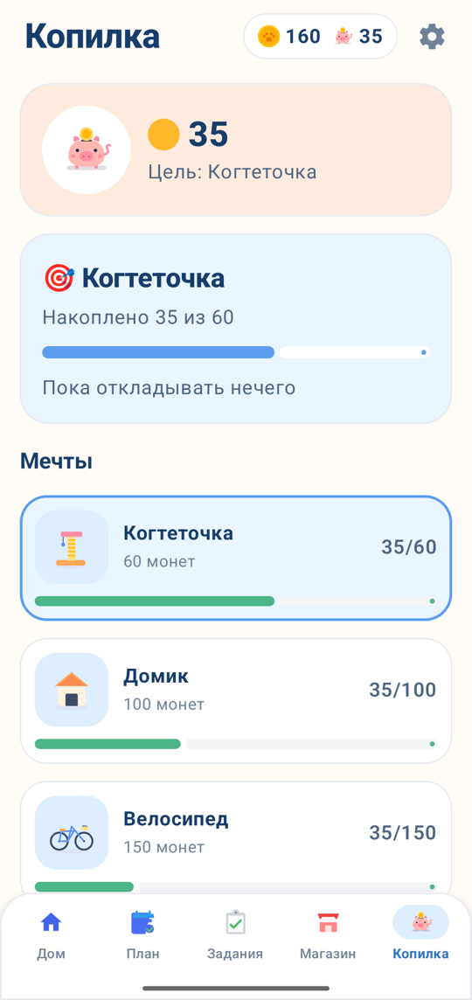

# CashPet

Мобильная игра для Android: ребёнок 7–11 лет заботится о коте из Котляндии и учится планировать бюджет, отличать нужное от желаемого и копить на цель. Проект команды «Мракобесы» для ЛЦТ 2026, задача №6 (Департамент финансов города Москвы).

**Версия 1.0.8** (сборка 8) · package `io.github.chalexey.cashpet` · Android 8.0+ · работает полностью офлайн, без регистрации, разрешений и сбора персональных данных.

| | |
| --- | --- |
| **APK** | [Releases → последний релиз](https://github.com/Ch-Alexey/CashPet/releases/latest) |
| **Документация** | [docs/README.md](docs/README.md) — архитектура, данные, игровой цикл, экономика |
| **Требования ТЗ и статус** | [docs/09-требования.md](docs/09-требования.md) |
| **Вопросы заказчику** | [docs/10-вопросы-заказчику.md](docs/10-вопросы-заказчику.md) |

<p>
  
  
  
  
</p>

Все экраны — в [документации](docs/README.md#экраны).

## Как играть

Игра идёт неделями. В начале недели ребёнок получает карманные и раскладывает их по плану «Нужно · Хочу · Отложить». Дальше — покупает коту корм и уход, выбирает желаемое, откладывает в копилку на мечту, проходит задания-ситуации и зарабатывает монеты. Неделю ребёнок завершает сам кнопкой. Итог недели показывает план и факт, а кот растёт от Малыша до Взрослого — за заботу о нужном, следование плану и накопления. Кот не болеет и не уходит; неудачное решение объясняется и показывает, как исправить.

**Для эксперта:** «Для взрослых» на стартовом экране → пример на умножение → «Запустить демо». Демо-профиль отдельный: все задания открыты, «Ускорить до взрослого» прогоняет недели тем же движком и показывает итог каждой.

## Запуск

**Готовый APK:** скачать из [последнего релиза](https://github.com/Ch-Alexey/CashPet/releases/latest), разрешить на телефоне установку из этого источника, установить.

**Из исходников.** Нужны Android Studio (с ней идут JDK и Android SDK) или JDK 21 + Android SDK (платформа 37). Подробно для Windows и Mac — [docs/04-окружение.md](docs/04-окружение.md).

- **Android Studio:** File → Open → папка проекта, дождаться синхронизации Gradle, выбрать телефон или эмулятор и нажать Run ▶.
- **Терминал:**

  ```bash
  ./gradlew test assembleDebug    # все тесты и APK в app/build/outputs/apk/debug/
  ./gradlew installDebug          # поставить на подключённый телефон
  ./gradlew :content:simulate     # симулятор экономики по настоящим JSON
  ```

  На Windows — `gradlew.bat`. Если Gradle не находит SDK, укажите путь в `local.properties` по образцу `local.properties.example` или в переменной `ANDROID_HOME`.

CI (GitHub Actions) на каждый PR и push в `main` запускает все тесты и собирает APK.

## Архитектура

```
app  ──►  data  ──►  core
  │                   ▲
  └──►  content ──────┘
```

| Модуль | Что внутри |
| --- | --- |
| `core` | Чистый Kotlin без Android: модели, движок недели `GameEngine` (бюджет, покупки, копилка, рост кота), прохождение заданий `TaskSession`, стратегии для «Ускорить» и симулятора |
| `content` | Учебный контент и все числа экономики в JSON, загрузчик, тесты-сторожа контента и баланса |
| `data` | Хранение в Room: всё состояние игры одним снимком, настройки, миграции |
| `app` | `GameStore` — единственное место, где игра меняется и сохраняется; ViewModel экранов; экраны на Jetpack Compose |

- **Одно состояние, чистый движок.** Всё состояние игры — один объект `GameState`. Движок — функция «состояние + действие → новое состояние или отказ с причиной». Правила (баланс не уходит в минус, покупки только после плана, стадия не понижается) живут в движке, а не на экранах.
- **Контент отдельно от кода.** Задания, товары, цели, тексты для ребёнка, цены и пороги — в `content/src/main/resources/content/*.json`. Новое задание — запись в `tasks.json` без изменения кода.
- **Хранение.** Room, после каждого действия — снимок состояния; сначала на диск, потом на экран. Обновление приложения не теряет прогресс: миграции и тест на сохранение прошлой версии.
- **Демо тем же движком.** «Ускорить» — цепочка обычных действий, поэтому демо показывает настоящую игру.

Подробно — [docs/11-архитектура.md](docs/11-архитектура.md), контракты для разработки — [docs/08-контракты.md](docs/08-контракты.md).

## Технологии

| | |
| --- | --- |
| Язык | Kotlin 2.4 |
| Интерфейс | Jetpack Compose (BOM 2026.09), Material 3, Navigation Compose |
| Состояние экранов | AndroidX ViewModel, `StateFlow`, Kotlin Coroutines 1.11 |
| Хранение | Room 2.8 (KSP), kotlinx.serialization 1.11 |
| Тесты | JUnit 6 (`core`, `content`), JUnit 4 + Robolectric (`data`, `app`) — 261 тест |
| Сборка | Gradle 9.8, Android Gradle Plugin 9.4, каталог версий `gradle/libs.versions.toml` |
| CI | GitHub Actions: тесты и APK на каждый PR |
| Платформа | minSdk 26 (Android 8.0), targetSdk 36, compileSdk 37; только портрет |

Внедрение зависимостей — вручную через `AppContainer`, без DI-фреймворков. Сети, аналитики и рекламы нет.

## Реализованные требования

Полная таблица со статусами и планом до финала — [docs/09-требования.md](docs/09-требования.md).

- **Старт и профиль:** онбординг о цели игры и трёх типах решений; гостевой режим — только игровое имя; выбор кота 3 породы × 3 окраса и его имени.
- **Главный экран:** кот, три показателя и фраза «почему сейчас так», баланс, копилка и цель, активное задание; переходы ко всем разделам.
- **Бюджет:** только внутриигровые монеты; начисления за задания, подработки и карманные — у каждого источник и сумма; план «Нужно · Хочу · Отложить» до начала недели, остаток, план и факт после подтверждения.
- **Покупки:** 15 товаров двух типов с ценой и влиянием на кота; покупка с подтверждением; баланс не уходит в минус — при нехватке объясняется, чего не хватает, и предлагаются варианты.
- **Накопления:** 3 цели, пополнение, срок до цели по среднему пополнению, снятие с показом «было → станет».
- **Задания:** 7 игровых ситуаций по трём темам с последствиями в числах, разбором и «Попробовать иначе».
- **Обратная связь:** панель «что изменилось и почему» после каждого действия, путь восстановления после неудачного решения.
- **Рост кота:** 3 стадии, зависят от нужного, плана и накоплений за несколько недель; причина изменения состояния объясняется.
- **Прогресс и словарь:** задания по темам, цели, итоги недель, 18 терминов.
- **Для взрослых:** барьер, цели приложения, пройденные темы и прогресс без оценок, сброс и удаление профиля.
- **Сохранение и демо:** прогресс сохраняется после каждого действия и переживает перезапуск; демо-профиль с «Ускорить» и сбросом.
- **Технические:** Android 8.0+, без сети и разрешений, запуск около 2 с, контент в JSON, отдельные модули, 261 тест в CI.

## Структура репозитория

| Путь | Что |
| --- | --- |
| `core/`, `content/`, `data/`, `app/` | Модули приложения |
| [docs/](docs/README.md) | Документация: функционал, экономика, архитектура, контракты, формат заданий, требования, вопросы заказчику |
| [requirements/](requirements/) | ТЗ, ответы заказчика, наш разбор ТЗ и принятые решения, требования к сдаче |
| `design/` | Исходники графики кота, журнал ИИ-генераций |
| `content/drafts/` | Черновики 19 заданий для финала |
| `.github/workflows/ci.yml` | CI |
| [CLAUDE.md](CLAUDE.md) | Правила проекта для ИИ-ассистента |

## Команда «Мракобесы»

| Кто | Зона |
| --- | --- |
| Алексей (Ch-Alexey) | Капитан: архитектура, движок и экономика, документация |
| Виталий (1Oblivious1) | Хранение, загрузка контента, ViewModel, демо-режим, тесты |
| Александр (Alexwww228) | Интерфейс и графика |
| Ярослав (Yaroslav4444-bauer) | Учебный контент и тексты, презентация |
