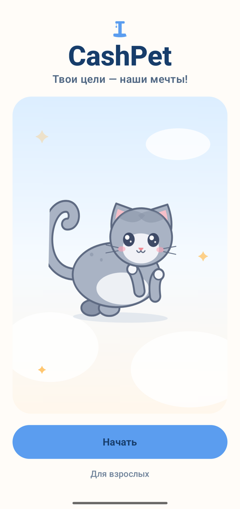
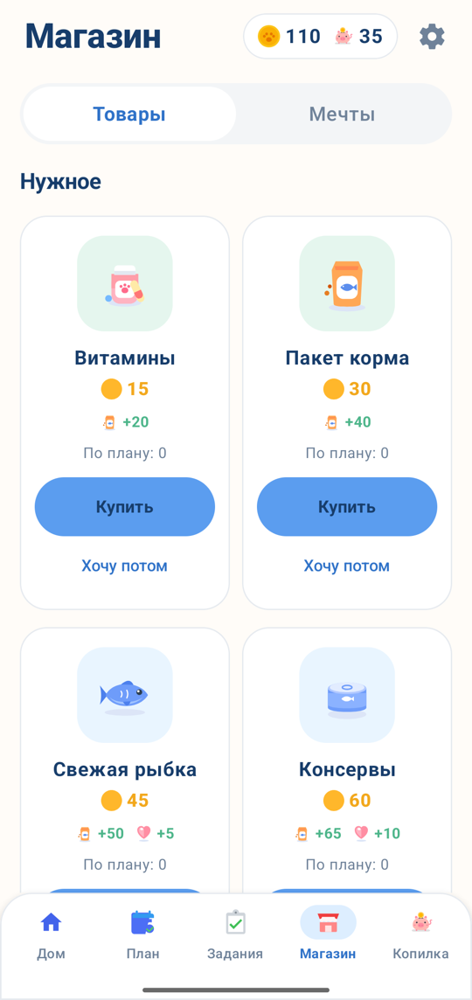
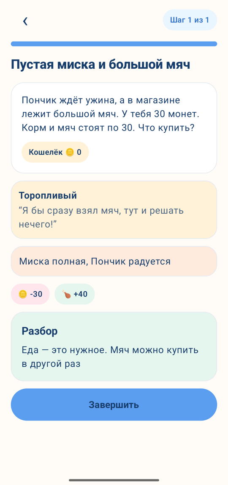
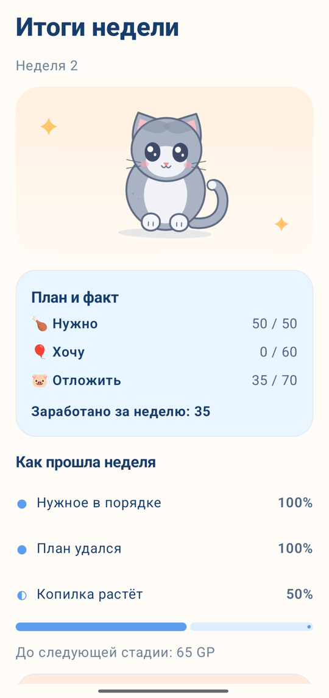
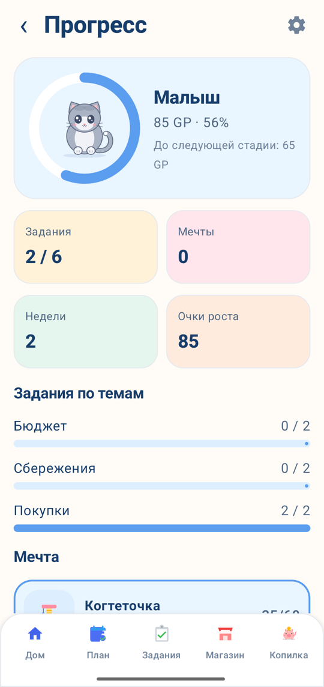
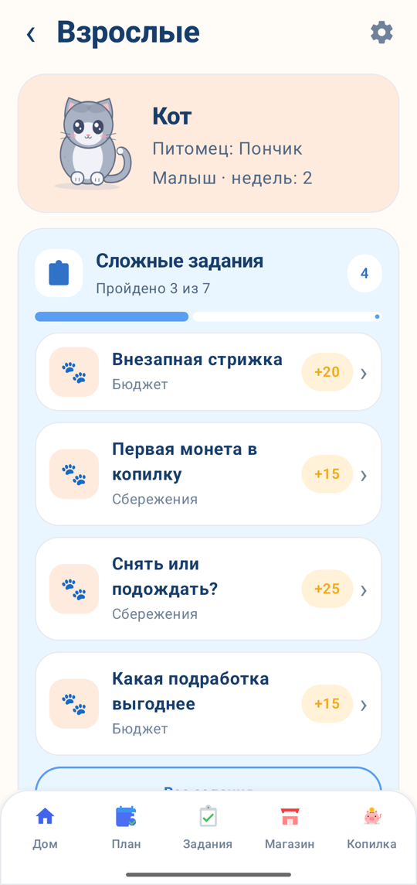
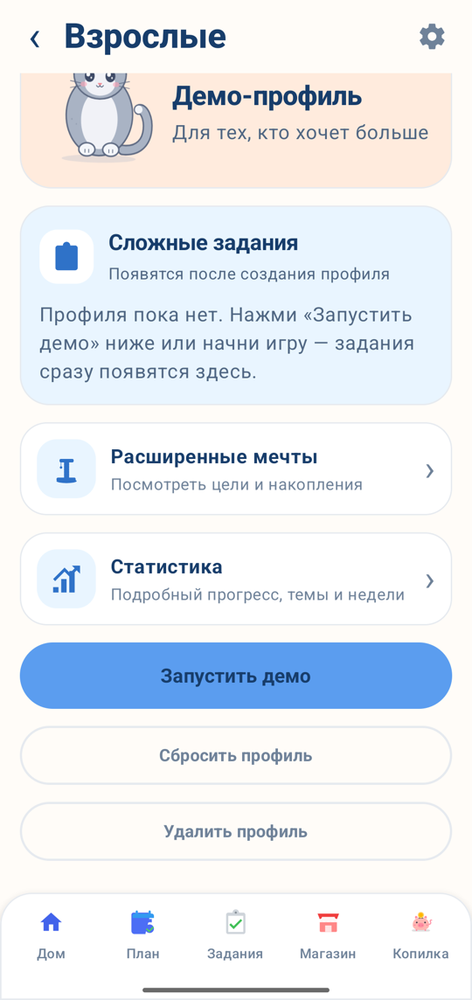

# CashPet · Документация

Пояснительная записка к промежуточной сдаче ЛЦТ 2026, задача №6. Версия приложения — 1.0.8. Код и инструкция по запуску — в [README репозитория](../README.md), APK — в [последнем релизе](https://github.com/Ch-Alexey/CashPet/releases/latest).

## Содержание

1. [О продукте](#о-продукте)
2. [Игровой цикл](#игровой-цикл)
3. [Экраны](#экраны)
4. [Архитектура и технологии](#архитектура-и-технологии)
5. [Данные и хранение](#данные-и-хранение)
6. [Экономика](#экономика)
7. [Контент](#контент)
8. [Качество](#качество)
9. [Сборка и запуск](#сборка-и-запуск)
10. [Ограничения прототипа и план до финала](#ограничения-прототипа-и-план-до-финала)
11. [Все документы](#все-документы)

## О продукте

**Для кого:** дети 7–11 лет; взрослые видят прогресс в отдельном разделе.

**Что формирует:** умение планировать небольшой бюджет, отличать нужное от желаемого, откладывать на цель и понимать последствия своих решений.

**Почему питомец:** ребёнок учится не на тестах, а на заботе о коте. Нужное — это корм и уход для кота, желаемое — игрушки и вещи, накопления — мечта кота (домик, велосипед). Кот растёт, когда ребёнок заботится о нужном, держится плана и копит. Неудачное решение не наказывается: кот не болеет и не уходит, игра объясняет, что произошло, и показывает путь восстановления.

**Принципы:** только внутриигровые монеты, нет рекламы, покупок, сети и сбора персональных данных; нет таймеров «успей», случайных наград и штрафов за пропуск; тексты короткие, без стыда и давления.

## Игровой цикл

Одна игровая неделя — один период бюджета. Неделю ребёнок завершает сам кнопкой, без ожидания реального времени.

1. **Карманные.** В начале недели на кошелёк приходят монеты (в первую — стартовые 100, дальше — по 60).
2. **План.** До трат ребёнок раскладывает монеты: «Нужно · Хочу · Отложить». Сумма не больше доступного, остаток виден. После подтверждения план не меняется, но тратить можно по-своему — в итоге покажем план и факт.
3. **Неделя.** Магазин (нужное и желаемое), копилка на мечту, задания-ситуации, подработки. После каждого действия — панель «что изменилось и почему».
4. **Итог недели.** План и факт, три значка роста (нужное куплено, план соблюдён, копилка растёт), очки роста, изменение кота и подсказка, что улучшить на следующей неделе.
5. **Рост.** Малыш → Подросток → Взрослый. Стадия не понижается, очки не сгорают.

**Демо-режим для эксперта:** стартовый экран → «Для взрослых» → пример на умножение → «Запустить демо». Отдельный профиль, все задания открыты, «Ускорить до взрослого» прогоняет недели тем же движком по стратегии «разумная игра» и показывает итог каждой недели. «Сбросить демо» возвращает к началу, профиль ребёнка не меняется.

Подробно — [01-функционал](01-функционал.md).

## Экраны

| | | |
| --- | --- | --- |
|  |  |  |
| Старт | Создание питомца: 3 породы × 3 окраса | Главный экран: кот, показатели, баланс, копилка, цель, задание |
|  |  |  |
| План недели «Нужно · Хочу · Отложить» | Магазин: нужное и желаемое | Копилка: цель, срок, пополнение и снятие |
|  |  |  |
| Задание: выбор, последствия, разбор | Итог недели: план и факт, рост кота | Прогресс и словарь |
|  |  | |
| Раздел взрослого: прогресс без оценок, задания | Демо-режим, сброс и удаление профиля | |

## Архитектура и технологии

```
app  ──►  data  ──►  core
  │                   ▲
  └──►  content ──────┘
```

| Модуль | Что внутри |
| --- | --- |
| `core` | Чистый Kotlin без Android: модели, движок недели, прохождение заданий, стратегии для демо и симулятора |
| `content` | Учебный контент и числа экономики в JSON, загрузчик, тесты-сторожа, симулятор баланса |
| `data` | Room: состояние игры одним снимком, настройки, миграции |
| `app` | `GameStore`, ViewModel экранов, экраны на Jetpack Compose, навигация |

Поток действия: экран → ViewModel → `GameStore.dispatch` → движок возвращает новое состояние или отказ с причиной → снимок в Room → экран показывает новое состояние и панель «что изменилось».

**Технологии:** Kotlin 2.4, Jetpack Compose (Material 3, Navigation Compose), AndroidX ViewModel, Coroutines и `StateFlow`, Room 2.8, kotlinx.serialization, JUnit 6 и Robolectric, Gradle 9.8 с каталогом версий, GitHub Actions. Android 8.0+ (minSdk 26), targetSdk 36.

Подробно — [11-архитектура](11-архитектура.md): модули, поток действия, ключевые решения, хранение. Контракты для разработки (модели, API движка, `UiState` экранов) — [08-контракты](08-контракты.md).

## Данные и хранение

- **Room**, две таблицы: `game_state` — всё состояние игры одним JSON-снимком (строка ребёнка и строка демо), `settings` — звук, анимации, показанные подсказки, открыт ли демо-режим.
- Снимок пишется после каждого действия, сначала на диск, потом на экран. Закрыли приложение в любой момент — при следующем запуске ребёнок там же.
- Каждое изменение кошелька или копилки — запись в журнале операций: неделя, источник, сумма, остаток после.
- Обновление приложения не теряет прогресс: новые поля — со значениями по умолчанию, таблицы — только с миграцией; тесты читают сохранение прошлой версии и базу версии 1.
- Данные не покидают устройство, резервное копирование Android выключено.

Подробно — [11-архитектура, раздел 2](11-архитектура.md#2-хранение).

## Экономика

| Параметр | Значение |
| --- | --- |
| Старт / карманные в неделю | 100 / 60 монет |
| Нужно коту в неделю | 50 монет: корм 30 + уход 20 |
| Задания | 15–25 монет за первое прохождение, по 2 новых в неделю |
| Подработки | 2 в неделю по 10 монет |
| Цели | Когтеточка, Домик, Велосипед |
| Очки роста за неделю | 40 · нужное + 30 · план + 30 · копилка |
| Стадии | Подросток — от 150 очков, Взрослый — от 350 |

Числа подобраны так, чтобы «разумная игра» выращивала кота до Взрослого на 4-й неделе, скопидом — на неделю позже, а транжира к 4-й неделе доходил до Подростка: медленнее, но без тупика. Это проверяют симулятор `./gradlew :content:simulate` и тест, который сверяет движок с таблицами трёх сценариев неделя в неделю. Все числа — в `economy.json`, не в коде.

Подробно — [02-экономика](02-экономика.md).

## Контент

- В JSON (`content/src/main/resources/content/`): 7 заданий по темам «бюджет», «покупки», «сбережения» и вводное, 15 товаров (7 нужных, 8 желаемых), 3 цели, 3 породы и 3 окраса кота, онбординг из 8 экранов, словарь из 18 терминов, фразы панели «что изменилось» и состояния кота.
- Задание — ситуация с 2–3 вариантами, последствия в числах, разбор для каждого варианта, путь восстановления после неудачного выбора, «Попробовать иначе».
- **Новое задание — одна запись в `tasks.json`** без изменения кода; формат — [07-формат-заданий](07-формат-заданий.md).
- Тесты-сторожа проверяют каждый текст: фразы до 12 слов, суммы кратны 5, у неудачного варианта есть путь восстановления, баланс игры не сломан.

## Качество

- **261 автоматический тест** в CI на каждый PR: правила движка, три сценария экономики, 300 случайных игр без ухода баланса в минус, сохранение и миграция базы, все ViewModel, весь контент.
- Ветка `main` защищена: слияние только через PR с зелёным CI и одобрением.
- Проверено на Xiaomi Redmi Note 14 Pro 5G (Android 16, 12 ГБ): полный сценарий, перезапуск без потери прогресса, холодный запуск около 2 с.

## Сборка и запуск

- **APK:** [последний релиз](https://github.com/Ch-Alexey/CashPet/releases/latest) → скачать `.apk` → разрешить установку → установить.
- **Из исходников:** Android Studio → File → Open → Run ▶, или `./gradlew test assembleDebug` — тесты и APK в `app/build/outputs/apk/debug/`. Окружение для Windows и Mac — [04-окружение](04-окружение.md).

## Ограничения прототипа и план до финала

- 7 заданий из 26 подготовленных; остальные 19 — до финала.
- Нет звуков и анимаций кота, мини-игр, событий-подарков и гардероба.
- Повторный показ подсказок экранов, проверка вёрстки на 360 dp и размера текста — до финала.
- Сборка — debug, без подписи (по ответу заказчика подпись для промежуточной сдачи не нужна).

Статус каждого требования ТЗ — [09-требования](09-требования.md), вопросы и ограничения для заказчика — [10-вопросы-заказчику](10-вопросы-заказчику.md).

## Все документы

| Документ | Что внутри |
| --- | --- |
| [01-функционал](01-функционал.md) | Все экраны и пользовательский путь, правила недели, магазина, копилки, заданий, демо |
| [02-экономика](02-экономика.md) | Доходы, каталог, показатели кота, формула роста, стадии, проверка баланса на трёх сценариях |
| [03-план](03-план.md) | Процесс разработки: роли, Git, тесты, требования к графике, план до финала |
| [04-окружение](04-окружение.md) | Что установить для сборки на Windows и Mac |
| [07-формат-заданий](07-формат-заданий.md) | Формат `tasks.json` и правила проверки контента |
| [08-контракты](08-контракты.md) | Модели, API движка, хранение, формат контента, состояния экранов |
| [09-требования](09-требования.md) | Таблица обязательных требований ТЗ со статусами |
| [10-вопросы-заказчику](10-вопросы-заказчику.md) | Вопросы и ограничения для консультации |
| [11-архитектура](11-архитектура.md) | Архитектура, хранение, контент, качество |
| [requirements/](../requirements/) | ТЗ, ответы заказчика, наш разбор ТЗ и все принятые решения, требования к сдаче |
